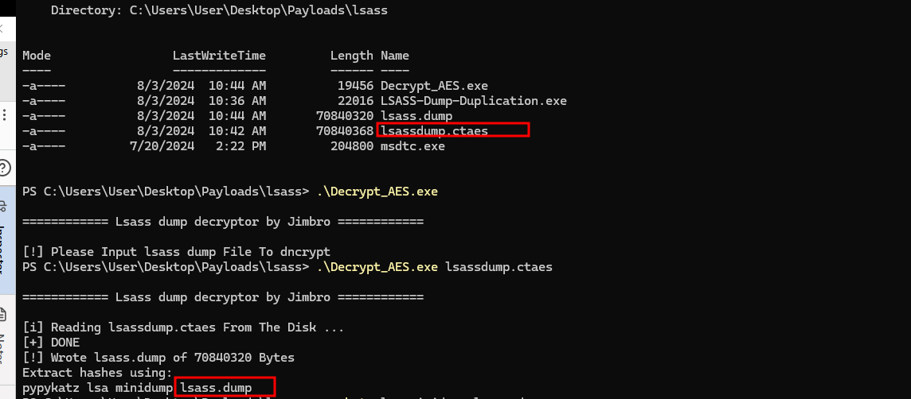
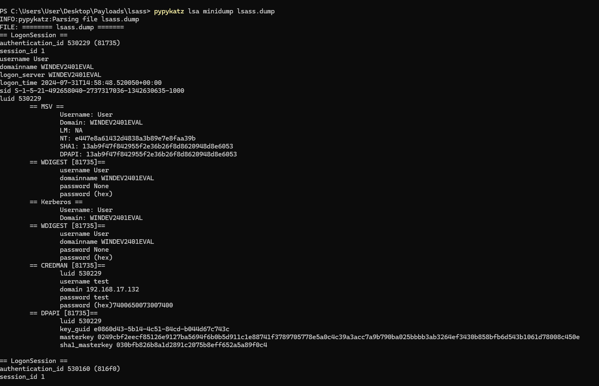

# Lsass-dump via duplicated handle with AES Encryption 

[LSASS-Dump-Duplication](LSASS-Dump-Duplication/LSASS-Dump-Duplication/LSASS-Dump-Duplication.c) 

- This is for dumping the LSASS using a duplicated handle, then performing AES encryption on the `lsass.dump` file before writing it to disk, as Defender will flag it otherwise.

[Decrypt AES](LSASS-Dump-Duplication/LSASS-Dump-Duplication/Decrypt_AES_File/Decrypt_AES_File.c) 
- This is for decrypting the encrypted `lsass.dump` file once it has been saved to a safe location and can be decrypted offline, such as using `pypykatz lsa minidump lsass.dump`

Compile in Visual Studio -> `x64` -> `Release`

# Screenshots DEMO 

